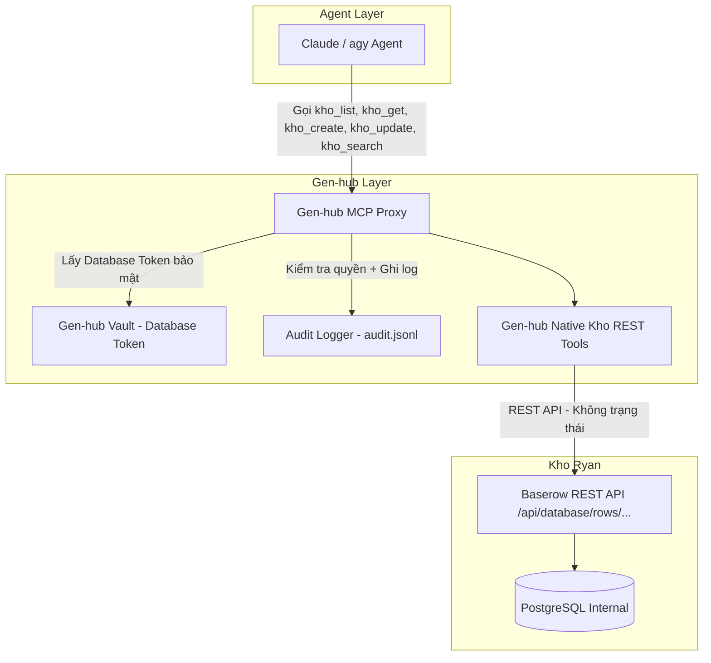
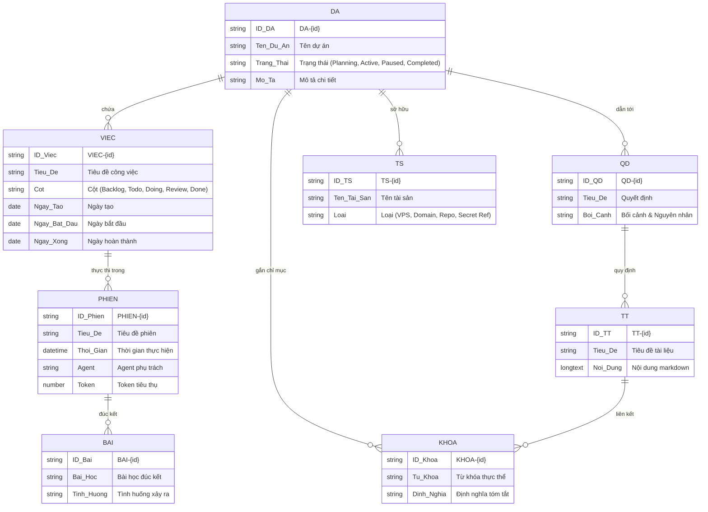

# Thiết kế Kho Ryan: Second Brain & Cơ sở tri thức có cấu trúc — Refs #125

> [!NOTE]
> **Tài liệu thiết kế kiến trúc (Architecture Design Document)**: Tài liệu này ghi lại kiến trúc, quyết định kỹ thuật và tiền lệ triển khai của "Kho Ryan" — second brain và cơ sở tri thức có cấu trúc của Boss Ryan trên nền tảng Baserow 1.33+, tích hợp trực tiếp vào Gen-hub (`Genesis-ryan-84-0567536339/Gen-hub`).
> Tham chiếu: [SPEC.md](https://github.com/Genesis-ryan-84-0567536339/Brain/blob/claude/hopeful-babbage-kwpcuf/specs/kho-ryan/SPEC.md), Issue [#125](https://github.com/Genesis-ryan-84-0567536339/Gen-hub/issues/125), Review của Claude tại [Issue #125 Comment](https://github.com/Genesis-ryan-84-0567536339/Gen-hub/issues/125#issuecomment-5854643481).

---

## 1. Bối cảnh & Mục tiêu

Gen-hub là trung tâm điều phối công cụ và danh tính (identity, MCP proxy, vault, audit) cho các AI agent phục vụ Boss Ryan. Trước khi có Kho, tri thức, trạng thái dự án, đầu việc, bài học kinh nghiệm và quyết định kiến trúc bị phân tán giữa các file Markdown, nhật ký hội thoại và bộ nhớ ngữ cảnh ngắn hạn của agent.

**Mục tiêu của Kho Ryan:**
1. **Second Brain có cấu trúc (Structured Second Brain):** Lưu trữ 8 thực thể dữ liệu hạt nhân (Dự án, Việc, Phiên, Quyết định, Bài học, Tri thức, Tài sản, Chỉ mục khóa) dưới dạng quan hệ hai chiều, view đa dạng (Grid, Kanban, Gallery).
2. **SSOT (Single Source of Truth):** Schema được định nghĩa tập trung bằng file khai báo `kho/schema.json`, tự động đồng bộ qua CLI mà không làm mất dữ liệu hiện có.
3. **Agent-accessible & Human-friendly:** Agent đọc/ghi thông qua giao thức MCP Streamable HTTP; Boss tương tác qua giao diện web trực quan trên cả máy tính và điện thoại thông minh (`https://kho.genos.top`).
4. **Bảo mật & Chủ quyền dữ liệu:** 100% self-hosted trên hạ tầng của Boss; secret/token lưu tại Gen-hub Vault, không đưa vào code hay Kho.

---

## 2. Quyết định kiến trúc đã chốt

### 2.1. Lựa chọn nền tảng: Baserow 1.33+ thay vì NocoDB hay Cloud SaaS

| Tiêu chí | Baserow (Được chọn) | NocoDB | Cloud SaaS (Airtable, Notion) |
| :--- | :--- | :--- | :--- |
| **Chủ quyền dữ liệu** | 100% self-hosted, chạy container cục bộ. | 100% self-hosted. | Dữ liệu nằm ở server bên thứ 3 (vi phạm nguyên tắc). |
| **Độ gọn nhẹ khi deploy** | 1 container all-in-one (PostgreSQL, Redis, Celery, Backend, Frontend). | Cần kết nối DB ngoài hoặc SQLite phức tạp hơn. | Không cần host. |
| **Giao thức MCP Agent** | Tích hợp sẵn MCP server gốc (Streamable HTTP). | Chưa có native MCP hoàn chỉnh. | Cần bên thứ 3 / Zapier / Make. |
| **REST API & Schema** | Swagger/OpenAPI tự động sinh theo từng bảng, API tokens phong phú. | API tự sinh nhưng cấu trúc phức tạp hơn. | Rate limit chặt, API hạn chế. |
| **Hệ thống View** | Hỗ trợ Grid, Kanban (Việc), Gallery (Bài học) xuất sắc. | Hỗ trợ nhưng UI mobile kém mượt mà hơn. | Tốt nhưng phụ thuộc cloud. |

### 2.2. Kết quả thử nghiệm thực tế: Subpath `/kho/` vs Subdomain `kho.{domain}`

Theo chỉ đạo tại review của Claude (Issue #125):
> *"Bước 1 thử chạy Baserow dưới /kho/ tối đa 30 phút; lỗi frontend/WebSocket → chuyển sang subdomain kho.genos.top (route Host trong Caddy + thêm hostname vào Cloudflare tunnel). Ghi kết quả thử vào PR."*

**Thực nghiệm thực tế:**
- Chúng tôi đã khởi chạy Baserow container thử nghiệm với biến môi trường `BASEROW_PUBLIC_URL=http://localhost:3001/kho/`.
- **Kết quả:**
  1. Yêu cầu `GET /kho/` trả về mã lỗi `404 Not Found`.
  2. Yêu cầu `GET /` trả về mã chuyển hướng `302 Found` tới `/login`.
  3. Mã nguồn frontend (Nuxt.js) và các route WebSocket/backend của image chính thức `baserow/baserow:1.33.2` hardcode đường dẫn tại root `/` và các endpoint API nội bộ `/api/*`. Việc cấu hình subpath rewrite phức tạp làm gãy tài nguyên tĩnh (assets chunking) và kết nối real-time WebSocket.
- **Quyết định kiến trúc:**
  - Chuyển sang định tuyến theo tên miền phụ: `kho.{domain}` (mặc định là `https://kho.genos.top`).
  - Caddy tự động cấu hình block định tuyến `Host kho.<domain>` chuyển tiếp tới container `kho` cổng 80, giữ nguyên tiêu đề `Host` và `X-Forwarded-*`.
  - Trên tên miền chính, route `/kho` và `/kho/*` chuyển hướng cố định `308 Permanent Redirect` tới `https://kho.<domain>/`.
  - Cloudflare Tunnel chỉ cần thêm public hostname `kho.genos.top` trỏ về Caddy reverse proxy trên host.

### 2.3. Đo lường tài nguyên thực tế & Giới hạn RAM

- **Bộ nhớ đo được thực tế:** Khi container Baserow khởi động và ở trạng thái idle, dung lượng RAM thực tế đo được qua `docker stats` là **~1.43 GiB** (do chạy kèm PostgreSQL 15, Redis, Celery worker và dịch vụ backend Django + frontend Nuxt).
- **Quyết định giới hạn:**
  - Thiết lập `mem_limit: '2g'` trong Compose manifest (`scripts/kho.py`).
  - Thiết lập `pids_limit: 256` để ngăn chặn fork-bomb hoặc tiến trình treo vô hạn.
  - Ngưỡng 2GB đảm bảo container hoạt động ổn định khi xử lý các truy vấn lọc lớn từ Agent hoặc thao tác đồng bộ hàng loạt mà không bị hệ điều hành OOM-killer can thiệp.

---

## 3. Kiến trúc Tích hợp Agent & MCP: Lựa chọn Nhánh B (Bộ công cụ REST mỏng)

Sau khi rà soát và thử nghiệm:
- **Thử nghiệm Nhánh A:** Baserow bản mới nhất (`baserow/baserow:2.3.4`, phát hành 15/09/2026) vẫn chỉ triển khai MCP transport dựa trên Server-Sent Events (SSE) tại `/mcp/<key>/sse`. Khi gửi request POST JSON-RPC `initialize` (Streamable HTTP theo spec MCP mới 2026-07-28), server từ chối vì thiếu SSE session (`405 Method Not Allowed` / session error).
- **Quyết định kiến trúc (Nhánh B):** Chuẩn MCP (2026-07-28) đã chính thức deprecate transport HTTP+SSE. Việc viết SSE client có trạng thái cho Gen-hub hoặc dựng thêm proxy (mcp-proxy, supergateway) sẽ làm phức tạp vận hành và tăng nguy cơ treo kết nối. Thay vào đó, **Gen-hub cung cấp trực tiếp bộ 5 công cụ MCP REST mỏng, phi trạng thái (stateless)**:

### 3.1. Bộ 5 Công cụ MCP REST của Kho Ryan
1. `kho_list(bang, filter?, limit?, page?)`: Liệt kê các bản ghi trong một bảng theo tên tiếng Việt hoặc tiền tố, hỗ trợ tìm kiếm và phân trang.
2. `kho_get(id)` (thay cho `kho_find_by_id`): Tra cứu chi tiết một bản ghi theo mã ID tiền tố ngữ nghĩa (`PHIEN-1`, `VIEC-12`, `DA-1`, `QD-3`, `BAI-5`, `TT-1`, `TS-2`, `KHOA-4`).
3. `kho_create(bang, fields)`: Tạo mới bản ghi trong bảng chỉ định, tự động gán mã ID tiền tố.
4. `kho_update(id, fields)`: Cập nhật các trường dữ liệu của bản ghi theo mã ID tiền tố.
5. `kho_search(text, bang?)`: Tìm kiếm toàn văn bản (full-text search) trên một hoặc toàn bộ 8 bảng của Kho Ryan.

### 3.2. Ưu điểm kiến trúc
- **Không trạng thái (Stateless):** Không cần duy trì kết nối SSE liên tục, không lo rớt session hay rò rỉ bộ nhớ.
- **Thân thiện với Agent:** Đặt tên công cụ và tham số theo tên bảng tiếng Việt ngữ nghĩa (`bang: 'Việc'`), không buộc agent phải nhớ ID số trừu tượng (`table_243`).
- **Bảo mật & Kiểm toán tuyệt đối:** Mọi thao tác đều dùng Database Token trong Vault, đi qua ma trận phân quyền của Hub và ghi nhận đầy đủ vào `audit.jsonl`.

---

## 4. Thiết kế Core Schema SSOT (8 Bảng Hạt Nhân)

Mọi bảng, trường dữ liệu, liên kết và view đều được định nghĩa tại `kho/schema.json` và thực thi qua `kho/schema.py`.

### Bảng 2: Việc (Task) — Tuân thủ bổ sung 3 trường ngày
Theo yêu cầu số 3 từ review của Claude:
Bảng **Việc** được trang bị đầy đủ 3 trường ngày để theo dõi chu kỳ thực thi:
1. `Ngày tạo` (Date): Ghi nhận thời điểm phát sinh công việc.
2. `Ngày bắt đầu` (Date): Ghi nhận thời điểm chuyển sang `Doing`.
3. `Ngày xong` (Date): Ghi nhận thời điểm hoàn thành và chuyển sang `Done`.
Bảng có chế độ xem mặc định dạng **Kanban** phân nhóm theo trường `Cột` (`Backlog`, `Todo`, `Doing`, `Review`, `Done`).

---

## 5. Ranh giới Bảo mật & Vận hành

1. **Vault Secret Isolation:** Token truy cập Baserow API được cấp và lưu trữ trong Gen-hub Vault (`server/vault.mjs`), mã hóa bằng thuật toán AES-256-GCM với `master.key`. Không bao giờ ghi token vào source code, file cấu hình công khai hay git commit.
2. **Container Isolation:** Container `gen-hub-kho` chạy trong Docker network riêng `gen-hub-net`, không mở port trực tiếp ra ngoài Internet mà chỉ thông qua reverse proxy Caddy cục bộ.
3. **Sao lưu Nhất quán (Consistent Backup):** Quá trình backup (`scripts/manage.py backup`) tạo snapshot nhất quán của volume `kho-data` vào file archive `.tar.gz`, đảm bảo tính toàn vẹn của cơ sở dữ liệu PostgreSQL bên trong container.
4. **Phân chia giai đoạn:**
   - **Giai đoạn 1 (PR này):** Hạ tầng container, Caddy subdomain routing, 8 bảng schema SSOT, công cụ tra cứu MCP, UI Hub, tài liệu thiết kế & vận hành.
   - **Giai đoạn tiếp theo (Deferred):** GitHub Action đồng bộ tự động `Brain -> Kho` và nâng cấp `skills-viewer` đọc cây kỹ năng từ Kho Ryan.
